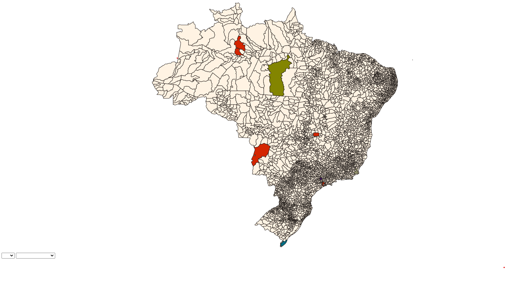

# Climate Project

The project aims to register data and create a data visualization of climate events in Brazil.


## How to execute?

Run command: `docker-compose up`

Access http://localhost:5000 

### To create a city, do this request:

```
curl --location 'http://localhost:5000/cities' \
--header 'Content-Type: application/json' \
--data '{
    "name": "GURUPI",
    "UF": "TO",
    "id": "1709500"
}'
```

### To create a event, do this request:

```
curl --location 'http://localhost:5000/events' \
--header 'Content-Type: application/json' \
--data '{
  "city": {
    "id": "1709500"
  },
  "eventType": "INUNDACAO",
  "initialDate": "2024-01-12T15:04:05.000Z",
  "finalDate": "2024-01-30T17:04:05.000Z",
  "rainPrecipitation": 65
}
```

### We can to show the data in map, do this request using a fork from [mapa-brasil](https://github.com/clagomess/mapa-brasil):

I use this project to create a visualization: https://github.com/Ronyell/mapa-brasil-climate


